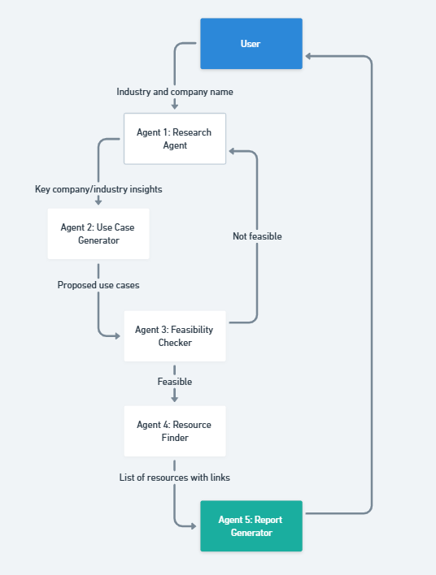

# **GENESIS:  : Genrative AI for Strategy and Industry Solutions**

---

## **Overview**
**GENESIS** is a multi-agent system designed to streamline the process of identifying and implementing AI/GenAI use cases tailored to specific industries and companies. The system operates through a series of specialized agents that perform individual tasks, gathering insights and generating solutions based on user inputs. Feedback is incorporated throughout the workflow to ensure relevant and practical outcomes.

---

## **Architecture Workflow**

### **1. User Input**
- **Objective**: Gather the necessary details from the user to customize the GENESIS workflow.
- **Inputs**:
  - **Mandatory**: Industry name and company name.
  - **Optional**: Specific focus areas such as operations, supply chain, etc.
- **Implementation**:
  - A simple web interface (e.g., Flask or Streamlit) or CLI can be used to collect this information.
  - Inputs are validated through predefined dropdowns or regex to ensure correctness.

---

### **2. Agent 1: Researcher Agent**
- **Task**: This agent performs retrieval tasks to gather company-specific and industry-specific insights.
- **Subtasks**:
  - Search the web for company profiles, articles, or annual reports.
  - Extract key insights such as company goals, policies, and focus areas.
  - Retrieve policy documents or reports from websites or PDFs (with OCR if necessary).
- **Tools**:
  - **Web scraping**: BeautifulSoup, Selenium, Scrapy.
  - **Document processing**: PyPDF2, Tesseract OCR.
  - **Summarization**: OpenAI API, Hugging Face transformers (e.g., BART, Pegasus).
  - **Knowledge retrieval**: LangChain with vector databases like Pinecone or FAISS.
- **Output**:
  - Key company insights and industry trends.
  - Extracted policies or strategic documents.

---

### **3. Agent 2: Use Case Generator**
- **Task**: This agent generates AI/GenAI use cases that align with the company’s strategic goals.
- **Subtasks**:
  - Analyze the company’s goals, challenges, and industry trends.
  - Generate a list of AI use cases that could help address these challenges (e.g., improving operations, enhancing customer experience).
- **Tools**:
  - **Language models**: OpenAI API (GPT-3.5/4), Cohere, Anthropic Claude.
  - **Template-based generation**: Use predefined templates that can be customized with AI-driven suggestions.
- **Output**:
  - A set of AI/GenAI use cases with descriptions, linked to the company's needs.

---

### **4. Agent 3: Resource Finder**
- **Task**: This agent identifies and gathers resources required to implement the generated use cases.
- **Subtasks**:
  - Search for relevant datasets from platforms like Kaggle or Hugging Face.
  - Identify the required tools, libraries, and APIs needed for implementation.
  - Generate clickable links to access these resources.
- **Tools**:
  - **APIs**: Kaggle API, Hugging Face Datasets API, GitHub search API.
  - **Libraries**: Requests for web queries, LangChain for semantic search.
  - **Automation**: Python scripts to gather and present resource links.
- **Output**:
  - A structured list of resources, such as datasets, libraries, and tools, necessary to implement the use cases.

---

### **5. Agent 4: Report Generator**
- **Task**: This agent compiles all the collected information into a comprehensive, user-friendly report.
- **Subtasks**:
  - Format the insights, use cases, and resources into a well-structured report.
  - Add interactive elements such as hyperlinks to external resources for easy access.
- **Tools**:
  - **Report generation**: Markdown or HTML templates.
  - **PDF export**: ReportLab, WeasyPrint for generating downloadable reports.
- **Output**:
  - A final report in PDF or HTML format, ready for presentation or further analysis.

---

## **Tools**
- **Web Scraping**: BeautifulSoup, Scrapy, Selenium.
- **Data Retrieval**: LangChain, Pinecone, FAISS.
- **Language Models**: OpenAI GPT-3.5/4, Hugging Face models.
- **APIs**: Kaggle, Hugging Face Datasets, GitHub Search.
- **Automation**: Python libraries like Requests, PyPDF2.
- **Frontend**: Streamlit/Flask for user interaction.

---
